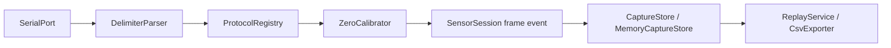
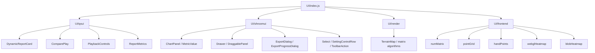
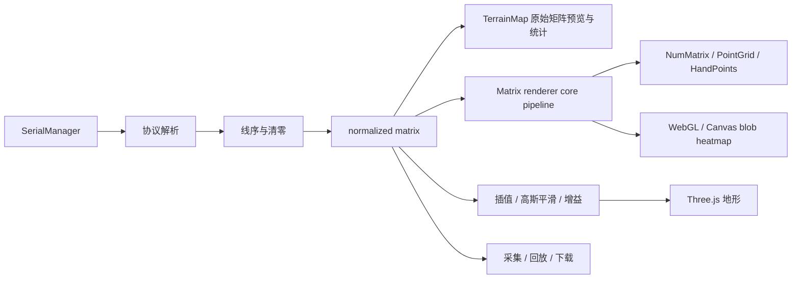

# Shroom SDK Architecture

最后更新于：2026-08-20

## 项目概述

Shroom SDK 是一个独立传感器 SDK，用于把主项目中的后端 HTTP/WebSocket 控制能力、本地串口读取链路、采集回放导出能力，以及前端展示组件抽离成可复用包。

## 技术栈

| 分类 | 技术 |
| :--- | :--- |
| 后端运行时 | Node.js, CommonJS |
| 串口 | `serialport`, `@serialport/parser-delimiter` |
| 存储与导出 | `better-sqlite3`, `csv-writer` |
| 实时通信 | `ws` |
| 文档与测试 | VitePress、Vue-to-React 实时示例桥接、Vitest |
| 前端 UI | React, Ant Design, MobX React, styled-components, i18next, react-i18next, Three.js, React Three Fiber, SCSS |

## 目录结构

```text
E:\ShroomSDK
├─ index.js                 SDK 后端根入口
├─ src\                     后端 SDK 模块
├─ examples\                后端和本地串口 demo
├─ docs\                    VitePress 中文文档
│  ├─ .vitepress\theme\     React 组件实时示例挂载与文档样式
│  └─ components\           每个 UI 组件的独立中文文档页
└─ UI\
   ├─ index.js              UI 聚合入口
   ├─ package.json          UI 子目录 ESM 配置
   ├─ frontend\             可独立使用的矩阵渲染前端包
   │  ├─ core\              注册表、帧总线、颜色和矩阵公共逻辑
   │  ├─ renderers\         五套 core/react 分层矩阵渲染器
   │  └─ styles\            渲染器宿主基础样式
   ├─ render\               矩阵与 Three.js 地形渲染 SDK
   ├─ qxui\                 动态报告和回放展示组件
   └─ shroomui\             基础 UI 组件库
```

## 核心模块与数据流



这条链路上的每一步都在 `handleRawFrame` 的独立 try/catch 里，`error` 事件的 `phase` 指明出错阶段（`rawFrame` / `parse` / `frame` / `capture`）。解析失败只丢当前帧，下一帧照常处理——采集程序不该因为一帧脏数据而退出。`error` 在没有监听者时降级为 `console.error` 而不是抛出（`EventEmitter` 对该事件名的默认行为是抛出，在 I/O 回调里即进程退出），但也不静默吞掉。

线序实现随包提供（`src/line/builtinLineOrders.js`），逐字搬自主项目的 `openWeb.js`。上游 SDK 是从主项目根目录动态 require 线序的，抽成独立包时那条 require 指向包外被移除，而 profile 里的线序声明留着，导致三个 profile 首帧抛错——`tests/backend-line-orders.test.mjs` 现在断言「声明了线序名的 profile，那个名字必须真的注册过」，防止同类回归。

前端 UI 组件不从 SDK 根入口加载，避免后端项目在 `require('shroom-backend-sdk')` 时引入 React 依赖。根 `package.json` 的 `exports` 为前端提供短路径（`shroom-backend-sdk/renderers/<id>`、`/core`、`/qxui`、`/shroomui`、`/render`），并把 `UI/render/index.d.ts` 接为 `types`。`UI/frontend` 子包自带的 exports 映射只服务子包直接消费者，根包这一层是给外部使用方的等价出口。

`exports` 是收口动作：声明之后未列出的子路径全部被封死，所以目录型入口必须逐条显式声明（`./UI/*` 这类通配不会为目录补 `index.js`），且通配范围收窄到已发布子树，避免触达 `files` 用 `!UI/render/prototypes` 排除掉的迁移参考件。全部已文档化的旧深路径由 `tests/package-exports.test.mjs` 用 Node 真实解析器逐条守住，只能增不能减。

## UI 组件结构



`UI/qxui` 偏业务展示，主要承接动态报告和压力热力图回放。`UI/shroomui` 偏基础展示，不直接请求后端、不读取设备 Store，业务状态通过 props 传入。`UI/render` 负责规范化矩阵的二维/三维渲染，不连接串口、不解析协议，也不执行线序转换。

### 矩阵渲染数据流



`TerrainMap` 的统计和矩阵缩略图使用输入的原始规范化矩阵；插值、高斯平滑和增益只作用于 Three.js 地形，不会写回输入数据。原项目版 `TerrainMapPage` 保存在 `UI/render/prototypes` 作为迁移参考，并从发布包中排除。

`UI/frontend/renderers` 下的五套渲染器同样只消费 normalized matrix。常规矩阵统一遵循 row-major 方向契约：`data[row * cols + col]` 直接对应显示位置，不在渲染器内部旋转、镜像或转置；专用手套、足底等物理线序仍由各自的显式命令入口处理。实时帧和回放帧进入同一 core pipeline；插值、阈值、配色和视角状态仅服务展示，不写回采集、回放或下载所持有的原始规范化帧。`registerBuiltinRenderers()` 只注册动态导入描述符，React、Three.js 和 WebGL 实现不会进入纯 core 的静态依赖图。

五个渲染器同时提供声明式和命令式两条帧入口。声明式 `frame`（`pointGrid` 另有 `backFrame`）由 `renderers/shared/react/useDeclarativeFrame.js` 推给各自的 `sitData` / `backData`，入参归一化在 `core/framePayload.js`（普通数组原样透传不复制，TypedArray 转一次，`{ wsPointData }` 保留额外字段）。prop 名不用 `data` —— 该键已被宿主回调 ref 占用。会整场重建的三个渲染器把 `paramsKey` 作为重推标记，参数变化后当前帧会用新参数重画一次；`pointGrid` 的标记额外拼上 `spriteUrl`，因为贴图不在归一化参数里。命令式 ref 通路一个方法都没有移除，两条可以在同一个实例上同时用。

点阵渲染器除等距网格外还支持按物理点位成形。`core/coordinateGrid.js` 把实测的稀疏坐标表（`{X,Y,Z}`，一个传感点一条）扩成与渲染网格等长的密集表，顺序是**先插值再补边**——与压力管线的 `interpSmall → addSide` 一致，因此第 N 个坐标与第 N 个压力值指向同一物理点位。参考实现 `carQXFbx.jsx` 的 `objdupli()` 是先补边，点数不同（16×16 / interp 2 / order 4 下 2304 与 1600），直接搬会让坐标与压力错位。坐标表的 `Z` 作为点的基础高度，压力叠加在它之上，弧面座垫与鞋垫起伏在无压力时即可见；`Z` 以整表均值为零点（实测值常带大偏置）并与 `X`/`Y` 共用缩放系数。`sparsePoints` 长度与 `num1 × num2` 不符时静默退回规则矩阵，而不是拿尺寸不符的表插值。

React 渲染器以宿主容器为尺寸边界：Three.js 点阵通过 `ResizeObserver` 同步相机和画布，Canvas 热力图在宿主短边内调整 backing store 并重绘最后一帧。GLB 手模是显式传入的可选运行时资源，SDK 默认只渲染手部点云；参数变化或卸载后到达的旧模型会被丢弃并释放。

地形曲面使用插值后的高密度几何体；网格层由 `buildTerrainWireSegments` 按输入矩阵的原始行列数独立生成，只连接有效区域的横向和纵向相邻点。网格不包含 Three.js 三角面线框的对角线，也不随插值倍数加密。

VitePress 文档通过 `UiComponentDemo.vue` 在客户端创建 React root，再由 `ComponentDemo.jsx` 按组件名加载真实 SDK 组件和模拟业务状态。组件独立页直接展示真实交互，静态构建阶段只渲染挂载容器，不执行浏览器 API。

六个矩阵渲染组件示例共享可折叠的 `ParamsEditor`：编辑区只接受 JSON 对象，解析失败时保留上一次有效配置。`UI/frontend/renderers` 的五个组件将对象作为 `params`；`TerrainMap` 将顶层字段映射为组件 props，并将 `options` 作为受控渲染配置。示例输入统一使用从 1 到矩阵元素数量的连续数组，元素数量由已应用的行列参数决定。两种热力图的 32×32 示例使用 `max: 1024`，点半径不超过相邻点间距的主要范围，避免递增数据和 alpha 重叠造成整图饱和。文档示例使用紧凑的响应式舞台，并覆盖旧渲染器的固定定位和固有画布尺寸，避免数值浮层及矩阵画布超出可视区域。`PointGridRenderer` 额外将点高度倍率和色阶上限纳入公开 `params`，文档工具栏可直接调节。

## 更新日志

| 日期 | 变更类型 | 说明 |
| :--- | :--- | :--- |
| 2026-08-11 | 新增功能 | 接入 `UI/qxui` React 组件，移除组件中的项目别名依赖，并新增 UI 文档展示页 |
| 2026-08-11 | 新增功能 | 接入 `UI/shroomui` 基础组件库，补全入口导出、SCSS 依赖说明和组件文档 |
| 2026-08-11 | 文档更新 | 将 VitePress 侧边栏拆为开始、后端与串口、UI 组件、API Reference 四个二级分组，并扩展 UI 组件展示页 |
| 2026-08-11 | 文档更新 | 将 17 个 UI 组件拆为独立页面，新增 Vue-to-React 实时示例桥接，并提供播放、滑块、抽屉、弹窗等可交互演示 |
| 2026-08-11 | 修复缺陷 | 修复 `qxui` 独立构建时的 React runtime、styled-components v6 导入和原项目根字号依赖问题，替换遗留 iconfont 图标 |
| 2026-08-11 | 新增功能 | 将 `TerrainMapPage` 提取为 `UI/render` 矩阵渲染 SDK，新增 Three.js 地形、矩阵预览、插值、平滑、配色和视角控制 |
| 2026-08-11 | 修复缺陷 | `TerrainMap` 网格恢复源项目的基础矩阵横纵线逻辑，只在有效压力区域生成线段，移除插值三角面产生的密集对角线 |
| 2026-08-11 | 发布优化 | 排除 `UI` 子项目中的 `node_modules`、`dist` 和 Vite 缓存，避免本地安装包递归包含开发依赖和文档构建产物 |
| 2026-08-11 | 类型与健壮性 | 为 `UI/render` 增加公开类型入口，并为网格算法的无效数值输入提供有限默认值 |
| 2026-08-11 | 新增功能 | 将 `numMatrix`、`pointGrid`、`handPoints`、`webglHeatmap`、`blobHeatmap` 整合到 `UI/frontend/renderers`，提供注册表和兼容导出 |
| 2026-08-11 | 文档更新 | 为五套矩阵渲染器新增独立中文页面、真实动态矩阵示例、控制项和二级导航 |
| 2026-08-11 | 修复缺陷 | 将点阵和手部渲染器迁移到 Three.js 当前 `outputColorSpace` API，消除旧颜色编码接口警告 |
| 2026-08-11 | 发布优化 | 矩阵渲染器改为跟随宿主容器尺寸，手模改为显式可选资源，并将 Three.js 最低版本收紧到 r152 |
| 2026-08-11 | 发布优化 | 根 npm 包仅发布运行源文件、示例和入口文档，不再包含 VitePress 站点与实施计划 |
| 2026-08-12 | 文档交互 | 五个矩阵渲染示例新增 `params` JSON 编辑器，输入帧统一为从 1 开始的连续递增数组 |
| 2026-08-12 | 文档交互 | `TerrainMap` 接入共享参数编辑器，六个矩阵组件示例补全常用公开参数并同步参数与演示输入 |
| 2026-08-14 | 修复缺陷 | 缩短矩阵示例参数区和渲染舞台，修复数字矩阵浮层、固定画布裁切及移动端非正方形问题 |
| 2026-08-14 | 文档交互 | 矩阵参数编辑器默认折叠，PointGrid 新增点高度和色阶上限参数及实时调节控件 |
| 2026-08-14 | 修复缺陷 | 统一 NumMatrix 与 PointGrid 的常规矩阵 row-major 方向，移除默认旋转和行列转置，并提供 `filterMin: 0` 原值展示配置 |
| 2026-08-20 | 新增功能 | 五套矩阵渲染器新增声明式 `frame` / `backFrame` prop，命令式 ref 通路保持不变 |
| 2026-08-20 | 文档更新 | `API_REFERENCE` 重写为参数级参考，补齐构造 options、方法签名、返回结构和已知限制 |
| 2026-08-20 | 发布优化 | 根包新增 `exports` 映射，前端短路径由 7 段降为 2 段，旧深路径全量保留兼容 |
| 2026-08-20 | 文档更新 | 补打包器配置（Vite / webpack）、peer deps 分组安装、五个渲染器参数表与静默钳制规则 |
| 2026-08-21 | 新增功能 | `PointGridRenderer` 支持按空间位置渲染：稀疏实测坐标表自动插值，Z 作为点的基础高度 |
| 2026-08-25 | 修复缺陷 | 补回 `jqbed` / `handSinglePoint` 内置线序，11 个 profile 全部可解析（此前 3 个首帧必崩） |
| 2026-08-25 | 修复缺陷 | `handleRawFrame` 分阶段捕获异常，`error` 无监听者时降级提示，多通道打开失败回滚已开端口 |
| 2026-08-25 | 测试补齐 | `src/` 从零测试到 69 项，覆盖解析、线序、清零、存储、回放与会话容错 |

## 项目进度

| 日期 | 完成项 | 说明 |
| :--- | :--- | :--- |
| 2026-07-08 | 后端 SDK 根入口 | 提供 `BackendSdkClient`、`ShroomSensorSDK`、协议、采集、回放、导出等能力 |
| 2026-07-08 | 本地串口 demo | 提供真实串口和 mock 模式验证链路 |
| 2026-07-08 | VitePress 文档 | 提供使用文档、API Reference、后端链路和串口链路 |
| 2026-08-11 | 动态报告 UI 组件 | 新增动态报告、回放控制、指标展示和热力图占位展示组件 |
| 2026-08-11 | 基础 UI 组件库 | 新增 `AsyncState`、`ChartPanel`、`Drawer`、`ExportDialog`、`MetricValue`、`Select`、`SettingControlRow`、`ToolbarAction` 等组件入口 |
| 2026-08-11 | UI 文档分组展示 | UI 文档按 `qxui` 和 `shroomui` 展示全部组件，并在侧边栏提供组件级锚点导航 |
| 2026-08-11 | UI 独立组件页 | 为全部 17 个 UI 组件提供独立中文页面、实时交互示例、最小用法和 Props/行为说明 |
| 2026-08-11 | 矩阵渲染 SDK | 新增 `TerrainMap`、矩阵归一化、高斯平滑、双三次插值和配色算法导出，并提供独立交互文档页 |
| 2026-08-11 | 地形网格一致性 | 新增可测试的 `buildTerrainWireSegments`，网格密度、连接方向和有效值阈值与原 `TerrainMapPage` 保持一致 |
| 2026-08-11 | 五套矩阵渲染器 SDK | 完成前端子包边界、core/react 分层、按需注册、旧路径兼容和 pnpm 发布文件约束 |
| 2026-08-11 | 矩阵渲染器交互文档 | 在矩阵渲染分栏下新增五个组件级页面，可直接查看动态效果并操作后端、视角和色阶 |
| 2026-08-11 | 外部宿主适配 | 五套矩阵渲染器完成宿主尺寸约束、可选模型加载和发布依赖边界核对 |
| 2026-08-12 | 渲染参数在线调试 | 文档页支持修改、应用和重置组件 `params`，并根据矩阵尺寸重建递增演示帧 |
| 2026-08-12 | TerrainMap 在线调参 | 文档页支持在线修改组件 props 和 `TerrainMapOptions`，输入数组随 `rows * columns` 自动重建 |
| 2026-08-14 | 渲染文档响应式适配 | 六个矩阵渲染页在桌面和移动视口中完整展示，数字矩阵保持正方形且不再裁切 |
| 2026-08-14 | PointGrid 显示调参 | `heightScale` 和 `colorMax` 可通过 SDK 参数或文档滑块控制，并兼容旧项目默认值 |
| 2026-08-14 | 矩阵方向一致性 | 常规矩阵输入按 `data[row * cols + col]` 原位置展示，NumMatrix 与 PointGrid 不再隐式改变方向 |
| 2026-08-14 | 全渲染方向与热图色阶 | 修正 PointGrid 上下方向和 BlobHeatmap 非方阵转置，关闭 WebglHeatmap 默认镜像，并按 1..1024 示例范围校准两种热力图色阶与点半径 |
| 2026-08-20 | 声明式帧入口 | 五个渲染器接入 `frame` prop，接入代码从「建 ref + useEffect + `sitData({ wsPointData })`」降为一个 prop |
| 2026-08-20 | 后端参数参考 | `API_REFERENCE` 覆盖全部根导出、构造 options、方法参数与返回结构，并标注存储、导出、实时通道的已知限制 |
| 2026-08-20 | 前端接入面收口 | 根包 `exports` 打通短路径与类型入口，`tests/package-exports.test.mjs` 锁死全部已文档化旧路径 |
| 2026-08-20 | 渲染参数文档补齐 | numMatrix 由 6 项补到 60 余项（含 `canvas2d` / `webgl` 嵌套对象），handPoints 由 4 项补到 19 项，五页均写明取值范围钳制 |
| 2026-08-21 | 空间位置点阵 | `core/coordinateGrid.js` 提供稀疏坐标表的插值与补边，点阵渲染器新增 `sparsePoints`，曲面传感器可按实测点位与自身起伏成形 |
| 2026-08-25 | 数据链路可用性 | 内置线序补回、帧处理全程容错、端口回滚；客户第一步「数据联通」不再因单帧异常终止进程 |
