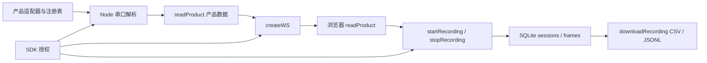

# Shroom SDK 架构

最后更新于：2026-11-04

## 1. 项目概述

本仓库维护独立的 `shroom-sdk`：读取传感器数据、按需创建 WebSocket 服务、采集到 SQLite、停止采集并导出 CSV / JSONL。快速入口只导出五个函数，产品协议和点位映射由内部适配器管理。Node.js、浏览器和 Python 共享版本号，但语言能力按各自文档定义。

当前版本 **0.4.0 已发布至 npm，latest 指向 0.4.0**，补充 130+146 字节手套分包，将 `glove` 别名与 `connectGlove()` 默认切换到分包；整包入口继续显式使用 `handGloveFullPacket`。客户安装命令为 `npm install --save-exact shroom-sdk@0.4.0`，Node 服务端与网页使用相同版本并重新构建前端。0.3.0 具有人体全身和鞋垫 A 版适配器，但不具有手套分包。Python 没有随版本号增加这些产品协议或五步服务能力。公开注册表的独立安装、SHA-512 完整性比对、五步调用和类型检查均通过；分包协议尚未完成实物验收。

官网与文档展示位于独立的 `shroomSDKWEB` 仓库，通过 `sdk/` Git 子模块固定本仓库的具体提交。SDK 的安装、测试、构建和发布均不依赖官网。官网构建使用固定提交中的文档、示例生成函数及下载包，不自动跟随 SDK 主分支。

仓库原来的 `shroom-backend-sdk@0.2.0` 已由当前五步 SDK 替换，旧实现保留在 `legacy-backend-sdk-0.2.0` 标签及 Git 历史。旧接口、组件、数据库不能被视作当前包的兼容能力；具体差异见 [MIGRATION.md](MIGRATION.md)。本文末尾保留旧项目进度与更新记录，作为历史记录。

## 2. 技术栈

| 分类 | 技术与边界 |
| --- | --- |
| JavaScript | ES Module；Node.js 运行时要求见根 `package.json`；浏览器使用 Web Serial 或 WebSocket |
| Python | Python 3.10+，同步迭代与通用矩阵接口；不提供 JS 五步 WS/SQLite 服务 |
| 串口 | Node `serialport`、浏览器 Web Serial、Python `pyserial` |
| 采集 | `better-sqlite3`，`sessions / frames` 表，批量事务与分页导出 |
| 通信 | `ws`，同端口 HTTP 下载；应用后端通过独立 `BackendSdkClient` 访问 |
| 依赖与类型 | npm 锁文件、Python 测试锁文件、TypeScript 声明与类型测试 |
| 验证与发布 | Node 内置测试、Python unittest、esbuild 运行包压缩、ZIP / npm TGZ、SHA256；GitHub Actions |
| 维护环境 | Node.js 22.22.0 / npm 10.9.4；Python 测试 3.11+，CI 3.12 |

## 3. 目录结构

```text
shroomSDK/
├─ src/                  SDK 运行实现与类型
│  ├─ quick-flow.js      五个函数的统一导出
│  ├─ flow/              快速调用编排
│  ├─ core/              协议、产品适配、数据结构与授权
│  │  └─ products/       registry、glove-segmented/glove/pad/body/insole 适配器及物理线序
│  ├─ node/              Node 串口与重连、WS 与 SQLite 采集
│  ├─ web/               浏览器串口、WS 与二维显示
│  └─ backend/           已有后端的 HTTP / WS 客户端
├─ examples/
│  ├─ products/          手套左右手与手垫的 HTML / MJS 示例
│  ├─ node/              命令行演示与示例授权配置
│  ├─ web/               网页测试台、模板与生成的 bundle
│  └─ product-*.js       官网和调用示例共用的生成器
├─ docs/                 接入、API、AI 上下文和发布说明
├─ scripts/              启动、构建、版本、打包与发布检查
├─ tests/                JavaScript 与类型测试
├─ python/               独立 Python 包、文档、示例和测试
├─ .github/              跨平台检查与 Release 草稿工作流
├─ package.json          公开包入口与开发命令
├─ package-lock.json     JavaScript 依赖锁
├─ tsconfig.json         类型检查配置
├─ README.md             使用说明与源码导航
├─ ARCHITECTURE.md       架构与累积工作记录
├─ CHANGELOG.md          版本变更
└─ MIGRATION.md          原有 SDK 的迁移边界
```

实现和类型集中在 `src/`，产品/Node/浏览器示例分别位于 `examples/products|node|web/`，启动器归入 `scripts/`。AI 上下文、后端说明和发布指南归入 `docs/`。根目录保留包配置、README、架构、变更与迁移说明。

兼容 ZIP 使用显式交付映射，将仓库源码映射回旧 `quick-flow.js`、`core|node|web|flow|backend/`、根示例与启动器；同时转换相对导入和文档链接。白名单仍排除测试、开发工具、依赖缓存和采集记录，不在源码仓库保留重复兼容文件。

JavaScript 集成优先使用 `npm install shroom-sdk` 从 npm 注册表安装，下载 `.tgz` 与历史官网 URL 继续可用。发布制品由 `scripts/pack-npm.mjs` 根据公开入口收集实际运行模块，在独立临时目录压缩并保留类型，再交给 npm 打包；客户从 `shroom-sdk/quick-flow` 导入五个函数。Node.js 保留相对模块结构，避免复制授权会话与模拟设备身份；浏览器通过条件导出选择独立入口，并用共享代码块保持同一环境内的模块状态。包中不含开发工具、测试、Python 或 source map。根目录直接 `npm pack` / `npm publish` 会由 `prepack` 阻止，提示使用受控打包命令。

`examples/product-call.js` 与 `product-flow.js` 接受 `importStyle: 'package'`，官网由此生成 `shroom-sdk/quick-flow` 和 `shroom-sdk/node|web` 的公开包名导入；默认 `relative` 保持 ZIP 示例可运行。客户安装文档纳入 `docs/catalog.json` 的 `npm` 页面，快速接入与 AI 上下文默认使用包入口，源码 ZIP 的路径转换单独说明。

## 4. 核心模块与数据流


```mermaid
flowchart LR
  A[产品适配器与注册表] --> B[Node 串口解析]
  B --> C[readProduct 产品数据]
  C --> D[createWS]
  D --> E[浏览器 readProduct]
  E --> F[startRecording / stopRecording]
  F --> G[SQLite sessions / frames]
  G --> H[downloadRecording CSV / JSONL]
  L[SDK 授权] --> B
  L --> D
  L --> F
```

五函数复用基础 API：`readProduct` 调用 Node `connectProduct` 或浏览器 `connectStream`；`createWS` 调用 `serveDevice`；采集和下载委托已有连接或服务方法。返回对象与 `stream` 保存当前会话，成功开始新采集时清除旧下载 ID。

串口查询属于五步前的准备：应用从 `shroom-sdk/node` 调用 `listPorts()` 展示列表，由用户选择实际 `path`；快速入口仍只导出五个函数。枚举不打开串口，不识别产品型号或左右手，也不自动选择列表第一个设备。

Node 串口通过 `src/node/serial-reconnect.js` 管理恢复生命周期，产品连接默认启用，通用 `connectSerial` 默认关闭。意外断线后先清理旧端口，再按原 `path` 每 3 秒尝试、最多 3 次；只有收到有效帧才重置尝试次数。首次打开失败、主动关闭、授权或解析错误、端口清理失败不进入重试。恢复保持设备对象和数据订阅，通过 `onStateChange` 暴露 `open / reconnecting / error / closed`；诊断保留累计计数，同时按本次连接判断是否真正收到数据。Web Serial、浏览器 WS 与 Python 本次未增加自动重连。

产品代码集中在 `src/core/products/`。增加产品通过适配器与注册表扩展协议、映射和 WS 字段校验，不改五个函数签名。产品扩展测试会在临时副本注册测试产品，验证串口、五步调用、录制、导出和浏览器 bundle 的一致性。

0.4.0 注册表包含分包手套 `handGloveSegmented`（`glove`）、兼容整包手套 `handGloveFullPacket`、手垫 `hand`（`pad`）、人体 `humanBody`（`body`）及鞋垫 `jqInsole`（`insole`）。别名只用于连接，帧和 WS 始终使用规范 ID。`prepareProductConnection` 先执行产品专属参数校验，再调用可选的 `adapter.resolveProfile(options)`；未实现该方法的适配器使用静态 profile。鞋垫以此选择显式 `protocol` 和支持的 `baudRate`，公共连接层不按产品添加条件分支，也不自动探测协议或速率。

| 适配器 / 线序文件 | 配置与输出边界 |
| --- | --- |
| `glove-segmented.js` / `glove.js` / `../glove.js` | 默认分包在单连接内按相同原始包类型配对 130/146 字节包，最大间隔 1 秒；重置/非法包清缓存，孤立尾包不交付。一只手一个串口，显式 side 决定五指/手掌线序，不根据 packetType 自动路由手侧，不构造整包假序号；输出无 sequence。整包适配器保留 274 字节与原 sequence |
| `body.js` / `body-layout.js` | 无 side；1000000 baud，1024 字节 uint8 载荷与尾分隔。保留 1024 原扫描 ADC，十个 `regions` 映射 400 唯一通道，索引用 Uint16；没有模型 UV、翻转、显示重复行或插值 |
| `insole.js` / `insole-layout.js` | 必须明确脚侧；默认 12bit、921600 baud，可选 8bit 及限定速率。12bit 的 raw 是 512 个原始 ADC 字节、pressure 是 256 个 Uint16 ADC（0–4095）；8bit 分别为 256 字节与 256 个 Uint8 ADC。`sensors` 是 A 版 112 真实点，不含显示插值点 |

人体的 32×32 与鞋垫的 16×16 顶层矩阵都是扫描存储形状，不能当人体/鞋形平面或物理重心。鞋垫保留 IMU 原始字节和 w/x/y/z 四元数，12bit 另提供陀螺仪/加速度的三个原始分量；不猜测单位、不融合姿态、不换算物理压力。来源和协议细节分别见 [HUMAN-BODY.md](docs/HUMAN-BODY.md)、[INSOLE.md](docs/INSOLE.md)。`profile.sensorPoints` 表示扫描通道数，新增可选 `mappedSensorPoints` 表示物理表覆盖的点数。

`src/index.d.ts` 的 `DeviceProductTypes` 登记所有产品，派生 Node/Web 选项与帧类型；分包与整包手套由 product 区分，只有整包帧有 sequence；鞋垫帧按 `protocol` 区分 12bit/8bit、ADC 类型和可用 IMU 字段。`stream-codec.js` 仍只处理基础帧，扩展字段由各适配器验证并复制；人体核对十块固定线序和 ADC 一致性，鞋垫核对精度、原始字节、真实点位及 IMU，避免 Uint8 截断或丢失负数 IMU。`createProductView` 支持分包/整包手套和手垫；人体/鞋垫仍由应用消费 `onData` 展示。

手套分包的 profile.payloadLength 与解析器 frameLength 都表示两包载荷合计 276 字节，不含各自 `AA 55 03 99` 帧尾。包标志 1/2 和包类型字节不是帧序号；packetType 仅校验首尾一致，不决定实物手侧。协议没有 CRC、连续帧标识和转义，配对与超时保护不能保证检测所有同类型丢包错配；载荷出现完整尾标记可能丢帧。说明与迁移入口见 [GLOVE.md](docs/GLOVE.md)。

录制使用 SQLite 事务批量写入；停止与关闭等待待写队列落库，导出按页读取。记录目录有独占所有权；异常退出记录可恢复为中断状态。兼容读取旧 JSONL 文件，不兼容原 `shroom-backend-sdk` 的 `captures / frames` 数据库。

设备断线时快速服务保留 WS 服务与设备引用，将当前采集以 `error` 收尾并保存已收到的数据。串口重连只恢复实时数据，不自动续录；应用确认恢复后显式再次调用 `startRecording` 创建新记录。

授权区分 SDK 与上位机产品密钥，检查有效期、电脑名额和功能权限，不按传感器型号限制。JS/Python 均提供结构化错误；连接阶段的拒绝由调用方捕获，连接后的运行错误通过订阅反馈。模拟数据源用于无硬件验证。

## 5. 快速服务端点

`createWS` 默认在 `127.0.0.1:19999` 创建本机服务，浏览器经同一服务获取数据和下载。跨主机使用必须显式指定允许的网页来源。

| 协议 | 路径或消息 | 用途 |
| --- | --- | --- |
| HTTP GET | `/health` | 服务、产品与采集状态 |
| HTTP GET | `/recordings/<id>.csv` | 导出已停止的采集记录 |
| HTTP GET | `/recordings/<id>.jsonl` | 导出完整帧记录 |
| WebSocket | `/` 或 `/ws` | 实时帧、状态与控制响应 |
| WS JSON | `recording.start / stop / status / list` | 带 `requestId` 的采集控制 |

这些端点属于快速本机服务；`BackendSdkClient` 访问的主项目 HTTP/WS 协议另见 [BACKEND.md](docs/BACKEND.md)。

## 6. 版本、发布与官网集成

根 `package.json.version` 同步到 `src/core/version.js`、Python 包元数据和 `_version.py`。发布检查包含原生依赖加载、JS/发布工具/Python 测试、类型检查及客户 ZIP 和 npm TGZ 独立安装验证。npm 消费测试从真实安装后的包名入口调用五步流程，并验证浏览器打包与类型解析。SDK 不运行官网的页面或服务测试。

构建输出 `dist/shroom-sdk.zip`、`dist/shroom-sdk-node.zip`、`dist/shroom-sdk-python.zip` 和 `dist/shroom-sdk-<版本>.tgz`。正式版本目录有七个文件：三个带版本 ZIP、一个 npm TGZ、`manifest.json`、`SHA256SUMS`、`RELEASE-NOTES.md`。清单记录真实 Git 提交与脏状态；相同版本不允许被不同内容或不同来源覆盖。

源码根包保留 `private: true` 与直接打包保护；受控生成的 npm TGZ 设为 `private: false`，`publishConfig` 指定公开访问与官方注册表。完整门禁通过后，维护者手动将已验证 TGZ 发布到 `https://registry.npmjs.org`，再执行 `npm run test:npm:registry`：从官方注册表安装当前版本，比对安装锁文件 SHA-512 与本地 TGZ，并复验五函数、WS / SQLite / CSV / JSONL、浏览器入口与类型。制品验证器默认兼容历史 `private: true` 安装包，`requirePublishable` 模式严格拒绝此类旧包作为发布制品；本地构建成功不等于远端发布成功。

2026-11-04 完整 SDK 发布门禁已通过：261 项 JavaScript、25 项发布工具、69 项 Python 测试，TypeScript、原生依赖加载、兼容 ZIP 独立安装、64 文件 npm TGZ 安装及 NodeNext/Bundler 类型解析均通过。覆盖人体 8 项与鞋垫 15 项专用测试、新产品经典浏览器脚本三种协议场景，以及 `tests/new-products-flow.test.mjs` 的合成串口字节 → 实际 WS/SQLite/HTTP 五步闭环；人体、左脚 12bit 与右脚 8bit 保留 ADC 精度、区域/点位与 IMU。官网整合门禁仍待更新子模块后执行；没有连接真实硬件，没有发布 npm，SDK 门禁通过不能替代这两项确认。

同日复核修正 `ProductDevice / NodeProductDevice` 默认帧类型为注册产品联合，`ProductFrame` 的 ADC 泛型支持 Uint8/Uint16；常规显式设备注解与协议收窄通过类型检查。增强的安装包验收从独立 `node_modules` 使用公开入口解析人体及鞋垫双协议，再跨 Node/浏览器 WS 编解码，确认 400 个唯一通道、112 个真实点、4095 与负 IMU 不丢失；NodeNext/Bundler 均通过。人体仍沿用来源的尾分隔规则，载荷内同值标记可能使该帧被丢弃，限制已写入 `HUMAN-BODY.md`。

客户使用 `npm install shroom-sdk` 安装到业务项目 `node_modules`，无需解压或登记；真实设备密钥另行申请。下载 `.tgz` 后手动安装及历史官网 URL 仍可用，本地文件依赖需要随项目保存安装包与锁文件。压缩并隐藏内部导入路径用于交付管理，不能作为防篡改或授权不可绕过的保证。

GitHub Actions 使用锁定工具版本与固定 Action 提交。普通提交运行检查；`sdk-vX.Y.Z` 标签触发 Windows/macOS/Linux 检查，Linux 打包并保存附件，具有写权限的后续任务重新验证附件再创建 Release 草稿。同名 Release 不覆盖。工作流不自动发布 npm、PyPI 或部署官网。

官网只在明确更新子模块指针后采用新的 SDK 提交；文档、产品示例、版本展示及兼容 ZIP 下载都来自该固定来源。SDK 发布和官网部署分别执行。

## 7. 环境变量

以下授权变量由源码 ZIP 的示例启动器显式调用 `activateLicenseFromEnv()` 时读取。精简 npm 包不交付该 helper；应用自行读取配置，再从 `shroom-sdk/node` 调用 `Shroom.activateLicense(key, { deviceId })`，保存稳定的安装标识。仅导入 SDK 不会自动激活。

| 变量 | 用途 |
| --- | --- |
| `SHROOM_LICENSE_KEY` | SDK 密钥字符串，优先于文件 |
| `SHROOM_LICENSE_FILE` | SDK 密钥文件路径 |
| `SHROOM_DEVICE_ID` | 覆盖本机稳定安装标识 |
| `SHROOM_LICENSE_MODE` | `online` 或 `offline` |
| `SHROOM_LICENSE_SERVER` | 授权服务地址 |
| `SHROOM_LICENSE_PUBLIC_KEY_FILE` | 离线验证公钥文件 |
| `SDK_PYTHON` | 维护测试使用的 Python 解释器 |
| `GITHUB_REF / GITHUB_SHA` | CI 发布的标签和提交校验来源 |

## 8. 项目进度

旧实现的累积完成记录保留在下方历史区，不代表当前包仍包含那些接口。

| 完成日期 | 完成的功能/工作 | 说明 |
| --- | --- | --- |
| 2026-10-30 | 独立五步 SDK 仓库 | 当前 Node/Web/Python SDK、适配器、授权、SQLite、文档与测试迁入根目录；官网固定提交引用 |
| 2026-10-30 | 独立构建与发布 | 版本、依赖锁、类型校验、客户 ZIP 验证、跨平台 CI 与 Release 草稿均在 SDK 仓库完成 |
| 2026-10-30 | npm 依赖安装交付 | 生成压缩运行代码与类型组成的 TGZ，保持五函数入口；增加客户安装、浏览器构建与类型验证，保留 ZIP 源码交付 |
| 2026-10-30 | 官网一步安装接入说明 | 客户从官网复制安装命令；示例支持包名与 ZIP 两种导入，快速文档及 AI 上下文采用公开包入口和授权 API |
| 2026-11-03 | SDK 源码目录归类 | 实现归入 src，演示归入 examples，维护与 AI 文档归入 docs，启动器归入 scripts；公开 npm 入口和旧 ZIP 路径保持兼容 |
| 2026-11-03 | npm 注册表交付流程 | 精简 TGZ 支持手动公开发布，根源码保持误发布保护；新增官方注册表安装与 SHA-512 比对验证，统一 npm 安装文档并保留历史制品安装 |
| 2026-11-03 | Node 产品串口重连与搜索准备 | 保留五函数；接入前由 listPorts 查询并选择串口，Node 产品默认同端口有限重试，状态订阅贯通快速流程；断线结束录制，恢复后显式新建记录 |
| 2026-11-03 | 发布 CLI 测试隔离 | CLI 与依赖在测试临时仓库内运行，避免升级维护仓库版本影响固定版本 fixture；保留版本不一致拒绝校验 |
| 2026-11-04 | 0.3.0 人体与鞋垫产品适配 | 独立协议/物理线序、动态 profile、类型与 WS 验证接入原五函数；合成数据通过真实 WS/SQLite/HTTP 闭环，保留 12bit 精度与原始 IMU；版本仅本地构建，尚未发布或真机验收 |
| 2026-11-04 | 0.3.0 完整 SDK 发布门禁 | 261 JS、25 发布工具、69 Python 测试及类型/原生依赖/客户 ZIP/npm TGZ 安装全部通过；经典脚本新增三种协议验证，官网门禁、远端发布与真机验收仍独立 |
| 2026-11-04 | 0.3.0 发布准备 | 按用户指令准备推送与npm发布；安装指南和示例转为0.3.0最低版本要求，保留双方同版本与真机未验证边界，发布结果另行验证 |
| 2026-11-04 | 分包手套接入说明与迁移 | 0.4.0 本地修订以 130+146 分包为默认，整包显式保留；补充字段、组帧限制、五函数/基础 API/AI 文档及迁移说明，测试结果待最终汇总 |
| 2026-11-04 | 单手单串口协议边界对齐 | 根据实物接入方式明确 side 决定线序，packetType 只作同连接配对键；同步协议、API、AI 与文档导航，不移植自动双手路由 |
| 2026-11-04 | 0.4.0 分包修订验证 | 281 项 JS、25 项发布工具、TypeScript 检查通过；65 文件 npm TGZ 在独立安装后验证分包、浏览器与 Node WS 及采集导出和 NodeNext/Bundler 类型，未发布 npm 或做真机验收 |
| 2026-11-04 | 共享版本回归 | Python 0.4.0 元数据与锁定依赖检查通过，69 项 Python 回归测试通过；Python 产品能力范围保持原样 |
| 2026-11-04 | 0.4.0 发布文档准备 | 客户安装命令固定到 0.4.0，移除当前版本的本地修订提示，保留整包手套显式入口、双端同版本与实物验收边界；最终打包与注册表发布结果另行记录 |
| 2026-11-04 | 0.4.0 正式发布与消费验证 | 源码提交 `50d0956c192c892f7bd701cbdde8e22bb0ae0b4b` 与 `sdk-v0.4.0` 标签已推送；npm 0.4.0 / latest 可用。完整本地发布门禁通过，公开注册表独立安装及 SHA-512 比对通过；最终 TGZ 为 118542 字节，SHA-256 为 `7adbe50638e965ab86b27263211f7aee752cecd82b44bcdb56bd88461ad8f024` |

## 9. 更新日志

| 日期 | 变更类型 | 描述 |
| --- | --- | --- |
| 2026-10-30 | 优化重构 | 按决定直接替换原主线 SDK，保留旧标签与历史；建立五步 SDK 和官网的独立仓库边界 |
| 2026-10-30 | 文档更新 | 更新根目录安装与发布说明，明确包身份、旧接口和数据库的迁移边界 |
| 2026-10-30 | 优化重构 | 增加 npm 精简安装包、受控打包与发布附件；文档区分客户安装和源码维护，说明注册表尚未发布及压缩的保护边界 |
| 2026-10-30 | 文档更新 | 新增安装 SDK 导航，统一官网命令安装、免登记下载与密钥另行申请；保留源码 ZIP 示例的相对路径兼容 |
| 2026-11-03 | 优化重构 | 整理源码、示例、文档和启动器，更新构建、交付映射及官网读取路径；五个函数及授权、采集语义不变 |
| 2026-11-03 | 配置变更 | 分离源码与发布包权限，增加发布后注册表消费检查；README、快速接入、基础 API 和 AI 说明采用 npm install shroom-sdk，发布指南补充登录、2FA、预览及制品发布步骤 |
| 2026-11-03 | 新增功能 | 0.2.0 移植 Node 串口有限重连，新增可配置重试与状态订阅；更新搜索串口、五步接入、基础 API 和 AI 文档，明确首次失败、手动关闭、授权、解析及录制恢复边界 |
| 2026-11-03 | 修复缺陷 | 发布制品 CLI 测试使用独立临时源码根目录，并验证版本不匹配仍被拒绝；发布校验规则保持不变 |
| 2026-11-04 | 新增功能 | 增加 humanBody/body 与 jqInsole/insole 适配器和来源文档；人体保留 1024 扫描/400 映射点，鞋垫保留双协议 ADC、112 真实点和 IMU；resolveProfile 与类型扩展不改变五函数，明确 0.3.0 未发布及真机验证边界 |
| 2026-11-04 | 验证完成 | 0.3.0 完整 SDK 门禁通过，含合成新产品的经典脚本和五步 WS/SQLite/HTTP 链路、客户 ZIP/TGZ 安装与 NodeNext/Bundler 类型解析；未执行远端发布或实机验收 |
| 2026-11-04 | 文档更新 | 准备正式0.3.0交付说明，更新npm固定版本命令并移除示例中的开发版限制提示；未改变协议、五函数或产品运行逻辑 |
| 2026-11-04 | 新增功能 | 补充分包手套适配器与明确的分包/整包类型边界，默认 glove/connectGlove 改分包；原五函数不变，整包需显式产品 ID，0.4.0 尚未发布与真机验收 |
| 2026-11-04 | 文档更新 | 修正分包类型字节与实物手侧的关系，明确单手单串口、显式左右手线序和无自动双手路由，并在文档目录登记手套协议页 |
| 2026-11-04 | 验证完成 | 0.4.0 分包解析、整包兼容、默认入口、模拟源、五步 WS/SQLite/HTTP 链路和独立 npm 安装通过；原五函数导出不变 |
| 2026-11-04 | 文档更新 | 准备 0.4.0 客户交付说明，统一 npm 固定版本与 TGZ 安装示例，保留协议迁移提示，并修正点位表元数据与分包适配器的关系；未改变运行代码或五函数 |
| 2026-11-04 | 版本发布 | 推送 SDK 0.4.0 源码与标签，发布已验证的精简 TGZ；从官方注册表重新安装并核对完整性，确认分包手套、五步流程、WS/SQLite/导出与 NodeNext/Bundler 类型可用 |

## 10. 原 SDK 历史记录

以下记录原样保留自替换前的架构文档，对应 `shroom-backend-sdk` 与旧 `src/`、`UI/` 布局。当前代码以本文第 1–9 节及当前 API 文档为准。

## 更新日志

| 日期 | 变更类型 | 说明 |
| :--- | :--- | :--- |
| 2026-08-11 | 新增功能 | 接入 `UI/qxui` React 组件，移除组件中的项目别名依赖，并新增 UI 文档展示页 |
| 2026-08-11 | 新增功能 | 接入 `UI/shroomui` 基础组件库，补全入口导出、SCSS 依赖说明和组件文档 |
| 2026-08-11 | 文档更新 | 将 VitePress 侧边栏拆为开始、后端与串口、UI 组件、API Reference 四个二级分组，并扩展 UI 组件展示页 |
| 2026-08-11 | 文档更新 | 将 17 个 UI 组件拆为独立页面，新增 Vue-to-React 实时示例桥接，并提供播放、滑块、抽屉、弹窗等可交互演示 |
| 2026-08-11 | 修复缺陷 | 修复 `qxui` 独立构建时的 React runtime、styled-components v6 导入和原项目根字号依赖问题，替换遗留 iconfont 图标 |
| 2026-08-11 | 新增功能 | 将 `TerrainMapPage` 提取为 `UI/render` 矩阵渲染 SDK，新增 Three.js 地形、矩阵预览、插值、平滑、配色和视角控制 |
| 2026-08-11 | 修复缺陷 | `TerrainMap` 网格恢复源项目的基础矩阵横纵线逻辑，只在有效压力区域生成线段，移除插值三角面产生的密集对角线 |
| 2026-08-11 | 发布优化 | 排除 `UI` 子项目中的 `node_modules`、`dist` 和 Vite 缓存，避免本地安装包递归包含开发依赖和文档构建产物 |
| 2026-08-11 | 类型与健壮性 | 为 `UI/render` 增加公开类型入口，并为网格算法的无效数值输入提供有限默认值 |
| 2026-08-11 | 新增功能 | 将 `numMatrix`、`pointGrid`、`handPoints`、`webglHeatmap`、`blobHeatmap` 整合到 `UI/frontend/renderers`，提供注册表和兼容导出 |
| 2026-08-11 | 文档更新 | 为五套矩阵渲染器新增独立中文页面、真实动态矩阵示例、控制项和二级导航 |
| 2026-08-11 | 修复缺陷 | 将点阵和手部渲染器迁移到 Three.js 当前 `outputColorSpace` API，消除旧颜色编码接口警告 |
| 2026-08-11 | 发布优化 | 矩阵渲染器改为跟随宿主容器尺寸，手模改为显式可选资源，并将 Three.js 最低版本收紧到 r152 |
| 2026-08-11 | 发布优化 | 根 npm 包仅发布运行源文件、示例和入口文档，不再包含 VitePress 站点与实施计划 |
| 2026-08-12 | 文档交互 | 五个矩阵渲染示例新增 `params` JSON 编辑器，输入帧统一为从 1 开始的连续递增数组 |
| 2026-08-12 | 文档交互 | `TerrainMap` 接入共享参数编辑器，六个矩阵组件示例补全常用公开参数并同步参数与演示输入 |
| 2026-08-14 | 修复缺陷 | 缩短矩阵示例参数区和渲染舞台，修复数字矩阵浮层、固定画布裁切及移动端非正方形问题 |
| 2026-08-14 | 文档交互 | 矩阵参数编辑器默认折叠，PointGrid 新增点高度和色阶上限参数及实时调节控件 |
| 2026-08-14 | 修复缺陷 | 统一 NumMatrix 与 PointGrid 的常规矩阵 row-major 方向，移除默认旋转和行列转置，并提供 `filterMin: 0` 原值展示配置 |
| 2026-08-20 | 新增功能 | 五套矩阵渲染器新增声明式 `frame` / `backFrame` prop，命令式 ref 通路保持不变 |
| 2026-08-20 | 文档更新 | `API_REFERENCE` 重写为参数级参考，补齐构造 options、方法签名、返回结构和已知限制 |
| 2026-08-20 | 发布优化 | 根包新增 `exports` 映射，前端短路径由 7 段降为 2 段，旧深路径全量保留兼容 |
| 2026-08-20 | 文档更新 | 补打包器配置（Vite / webpack）、peer deps 分组安装、五个渲染器参数表与静默钳制规则 |
| 2026-08-21 | 新增功能 | `PointGridRenderer` 支持按空间位置渲染：稀疏实测坐标表自动插值，Z 作为点的基础高度 |
| 2026-08-25 | 修复缺陷 | 补回 `jqbed` / `handSinglePoint` 内置线序，11 个 profile 全部可解析（此前 3 个首帧必崩） |
| 2026-08-25 | 修复缺陷 | `handleRawFrame` 分阶段捕获异常，`error` 无监听者时降级提示，多通道打开失败回滚已开端口 |
| 2026-08-25 | 测试补齐 | `src/` 从零测试到 69 项，覆盖解析、线序、清零、存储、回放与会话容错 |
| 2026-08-25 | 手套 SDK | 明确四个产品 Profile，补齐分包/整包组帧、压力与 IMU 语义、左右手 Mapping 和 `connectGlove()` |
| 2026-08-25 | 手套校验 | 新增生产协议形态 fixture，覆盖左右交错组帧、缺首包、长度校验、IMU float32LE 和 256→147/195→1024 Mapping |
| 2026-08-25 | 手套点位表 | 录入左右手结构化 Mapping，扁平线序改为自动生成并增加范围、重复点和布局校验 |
| 2026-08-27 | 采集 SDK | 参考 `E:\shroom1` 抽取按通道限频、全帧模式、批量事务、停止 flush、磁盘保护和采集错误状态 |
| 2026-08-27 | 串口 SDK | 参考 `E:\shroom` 补齐 `SerialManager`、自动波特率、稳定重试、连接锁、断流状态、重扫、写串口和统一错误码 |
| 2026-08-28 | 后端能力闭环 | 补齐存储分页/筛选/删除、可控回放、CSV 算法列和简单算法通道，六项能力使用统一标准帧 |
| 2026-08-28 | 文档更新 | 新增 `Backend Capabilities` 页面和串口、采集、存储、回放、CSV、算法通道二级导航 |

## 项目进度

| 日期 | 完成项 | 说明 |
| :--- | :--- | :--- |
| 2026-07-08 | 后端 SDK 根入口 | 提供 `BackendSdkClient`、`ShroomSensorSDK`、协议、采集、回放、导出等能力 |
| 2026-07-08 | 本地串口 demo | 提供真实串口和 mock 模式验证链路 |
| 2026-07-08 | VitePress 文档 | 提供使用文档、API Reference、后端链路和串口链路 |
| 2026-08-11 | 动态报告 UI 组件 | 新增动态报告、回放控制、指标展示和热力图占位展示组件 |
| 2026-08-11 | 基础 UI 组件库 | 新增 `AsyncState`、`ChartPanel`、`Drawer`、`ExportDialog`、`MetricValue`、`Select`、`SettingControlRow`、`ToolbarAction` 等组件入口 |
| 2026-08-11 | UI 文档分组展示 | UI 文档按 `qxui` 和 `shroomui` 展示全部组件，并在侧边栏提供组件级锚点导航 |
| 2026-08-11 | UI 独立组件页 | 为全部 17 个 UI 组件提供独立中文页面、实时交互示例、最小用法和 Props/行为说明 |
| 2026-08-11 | 矩阵渲染 SDK | 新增 `TerrainMap`、矩阵归一化、高斯平滑、双三次插值和配色算法导出，并提供独立交互文档页 |
| 2026-08-11 | 地形网格一致性 | 新增可测试的 `buildTerrainWireSegments`，网格密度、连接方向和有效值阈值与原 `TerrainMapPage` 保持一致 |
| 2026-08-11 | 五套矩阵渲染器 SDK | 完成前端子包边界、core/react 分层、按需注册、旧路径兼容和 pnpm 发布文件约束 |
| 2026-08-11 | 矩阵渲染器交互文档 | 在矩阵渲染分栏下新增五个组件级页面，可直接查看动态效果并操作后端、视角和色阶 |
| 2026-08-11 | 外部宿主适配 | 五套矩阵渲染器完成宿主尺寸约束、可选模型加载和发布依赖边界核对 |
| 2026-08-12 | 渲染参数在线调试 | 文档页支持修改、应用和重置组件 `params`，并根据矩阵尺寸重建递增演示帧 |
| 2026-08-12 | TerrainMap 在线调参 | 文档页支持在线修改组件 props 和 `TerrainMapOptions`，输入数组随 `rows * columns` 自动重建 |
| 2026-08-14 | 渲染文档响应式适配 | 六个矩阵渲染页在桌面和移动视口中完整展示，数字矩阵保持正方形且不再裁切 |
| 2026-08-14 | PointGrid 显示调参 | `heightScale` 和 `colorMax` 可通过 SDK 参数或文档滑块控制，并兼容旧项目默认值 |
| 2026-08-14 | 矩阵方向一致性 | 常规矩阵输入按 `data[row * cols + col]` 原位置展示，NumMatrix 与 PointGrid 不再隐式改变方向 |
| 2026-08-14 | 全渲染方向与热图色阶 | 修正 PointGrid 上下方向和 BlobHeatmap 非方阵转置，关闭 WebglHeatmap 默认镜像，并按 1..1024 示例范围校准两种热力图色阶与点半径 |
| 2026-08-20 | 声明式帧入口 | 五个渲染器接入 `frame` prop，接入代码从「建 ref + useEffect + `sitData({ wsPointData })`」降为一个 prop |
| 2026-08-20 | 后端参数参考 | `API_REFERENCE` 覆盖全部根导出、构造 options、方法参数与返回结构，并标注存储、导出、实时通道的已知限制 |
| 2026-08-20 | 前端接入面收口 | 根包 `exports` 打通短路径与类型入口，`tests/package-exports.test.mjs` 锁死全部已文档化旧路径 |
| 2026-08-20 | 渲染参数文档补齐 | numMatrix 由 6 项补到 60 余项（含 `canvas2d` / `webgl` 嵌套对象），handPoints 由 4 项补到 19 项，五页均写明取值范围钳制 |
| 2026-08-21 | 空间位置点阵 | `core/coordinateGrid.js` 提供稀疏坐标表的插值与补边，点阵渲染器新增 `sparsePoints`，曲面传感器可按实测点位与自身起伏成形 |
| 2026-08-25 | 数据链路可用性 | 内置线序补回、帧处理全程容错、端口回滚；客户第一步「数据联通」不再因单帧异常终止进程 |
| 2026-08-25 | 手套最小链路 | `connectGlove()` 完成查口/连接/组帧/解析/左右手 Mapping，帧可直接送入 32×32 渲染器或采集链路 |
| 2026-08-25 | 左右手 Mapping | 五指、指腹、手掌点位进入 SDK 单一数据源，外部项目可通过 `GLOVE_HAND_MAPPING` 读取原始分组 |
| 2026-08-27 | 稳定采集链路 | `CaptureController` 统一管理采集频率、批次和统计，SQLite/内存 Store 对齐 `insertFrames`，会话关闭不再遗留未落库帧 |
| 2026-08-27 | 串口管理闭环 | 同时支持手动与一键连接，聚合所有串口的最新数据、在线/断流状态，并打通写入、重连、重扫和错误处理 |
| 2026-08-28 | 后端六项能力 | 串口、采集、存储、回放、CSV 和简单算法通道均提供根入口、统一数据流、测试与本地网页文档 |
