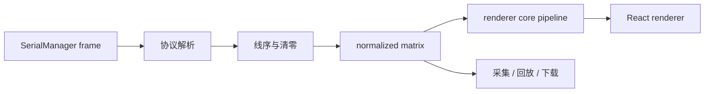

# Matrix Renderers Integration Design

## Goal

将新增的五套矩阵渲染器接入 Shroom SDK，归入现有“矩阵渲染”分类，与 `TerrainMap` 并列。渲染器只消费协议解析、线序转换和清零后的矩阵帧，不连接串口，也不负责采集、回放或下载。

## Scope

本次接入以下渲染器：

| renderer id | React component | 用途 |
| :--- | :--- | :--- |
| `numMatrix` | `NumMatrixRenderer` | Canvas 2D、精灵 3D 或 WebGL 数字矩阵 |
| `pointGrid` | `PointGridRenderer` | 可旋转、可框选的三维压力点阵 |
| `handPoints` | `HandPointsRenderer` | 手部压力点云和 IMU 姿态展示 |
| `webglHeatmap` | `WebglHeatmapRenderer` | WebGL 斑点叠加热力图 |
| `blobHeatmap` | `BlobHeatmapRenderer` | Canvas 2D 斑点热力图 |

保留现有 `UI/render/TerrainMap`，不在本次工作中合并两套实现，也不改动后端串口、存储和回放协议。

## Directory Boundary

新增目录当前位于 `UI/renderers`，但代码中的相对导入以 `frontend/core`、`frontend/renderers` 同级为前提。实施时将目录机械移动为：

```text
UI/frontend/
├─ core/                  公共契约、注册表、矩阵算法和配色
├─ renderers/             五套纵向渲染器模块
│  ├─ numMatrix/
│  ├─ pointGrid/
│  ├─ handPoints/
│  ├─ webglHeatmap/
│  ├─ blobHeatmap/
│  └─ shared/
├─ styles/                渲染器公共样式
├─ index.js               frontend SDK 入口
└─ package.json           独立前端包边界和 exports
```

每个渲染器继续保持 `core/` 与 `react/` 两层：纯算法可在 Node 环境测试，React/Three/WebGL/Canvas 生命周期留在浏览器层。

## Public API

主 SDK 通过 `UI/index.js` 增加不静态加载 React 组件的命名空间：

```js
export * as MatrixRenderers from './frontend/renderers/index.js'
```

推荐使用方式：

```js
import { MatrixRenderers } from 'shroom-backend-sdk/UI'

MatrixRenderers.registerBuiltinRenderers()
```

直接组件按深路径导入，避免使用一个组件时打包全部渲染器：

```jsx
import NumMatrixRenderer from 'shroom-backend-sdk/UI/frontend/renderers/numMatrix/react/NumMatrixRenderer.jsx'
```

`UI/frontend/package.json` 同时保留 `@shroom/frontend` 的独立包入口、按需导出和旧路径兼容映射。根包发布清单包含源码和资源，但排除测试、文档构建产物与嵌套依赖。

## Data Flow



实时和回放必须向渲染器传入相同结构的规范化矩阵。插值、配色、阈值、点位高度等仅属于展示层，不写回采集数据，也不改变 CSV 下载内容。

## Documentation UX

VitePress 左侧“矩阵渲染 render”分组增加五个页面，并保留 `TerrainMap`：

1. `TerrainMap`
2. `NumMatrixRenderer`
3. `PointGridRenderer`
4. `HandPointsRenderer`
5. `WebglHeatmapRenderer`
6. `BlobHeatmapRenderer`

每个页面包含：真实组件示例、最小导入方式、输入矩阵约定、关键参数、公开命令和依赖说明。示例使用确定性的模拟矩阵，不连接串口；能交互的视角、阈值、配色或后端模式必须实际生效。

## Error Handling

- 参数归一化函数继续处理缺失字段和历史预设。
- 输入长度与行列不一致时，由现有 core pipeline 的规则裁剪或补零，文档明确该行为。
- WebGL/Three 初始化失败时，示例显示明确错误状态，不能留下空白区域。
- 注册失败通过现有 registry failure API 暴露，不让单个错误渲染器阻断其他渲染器。
- 浏览器资源在卸载时释放，包括动画帧、Three 几何体/材质、WebGL buffer/program 和事件监听器。

## Testing And Verification

实施完成后验证：

- 运行新增目录现有的 core、registry、structure 和 builtins 测试。
- 增加 SDK 公开入口和按需动态导入测试。
- 构建 VitePress 文档。
- 在桌面和移动视口逐页截图，确认 Canvas/WebGL/Three 内容非空、尺寸稳定、控件无重叠。
- 对 Canvas/WebGL 示例执行像素检查，确认不是只有背景色。
- 执行 `pnpm pack --dry-run`，确认包含五套渲染器源码和 `circle.png`，且不包含测试、`node_modules`、`dist` 或 `.vite`。

## Non-Goals

- 不新增串口协议、线序函数或数据库表。
- 不把五套渲染器重写为 `TerrainMap` 的配置模式。
- 不新增业务页面、设备 Store 或 WebSocket 客户端。
- 不在本次接入中重构渲染器内部已经通过测试的历史算法。

## Success Criteria

使用者可以从本地 Shroom SDK 按需导入五套渲染器；文档侧边栏可进入每个独立页面并看到真实交互效果；实时和回放矩阵可复用同一组件接口；测试、类型/入口检查、文档构建和发布清单全部通过。
